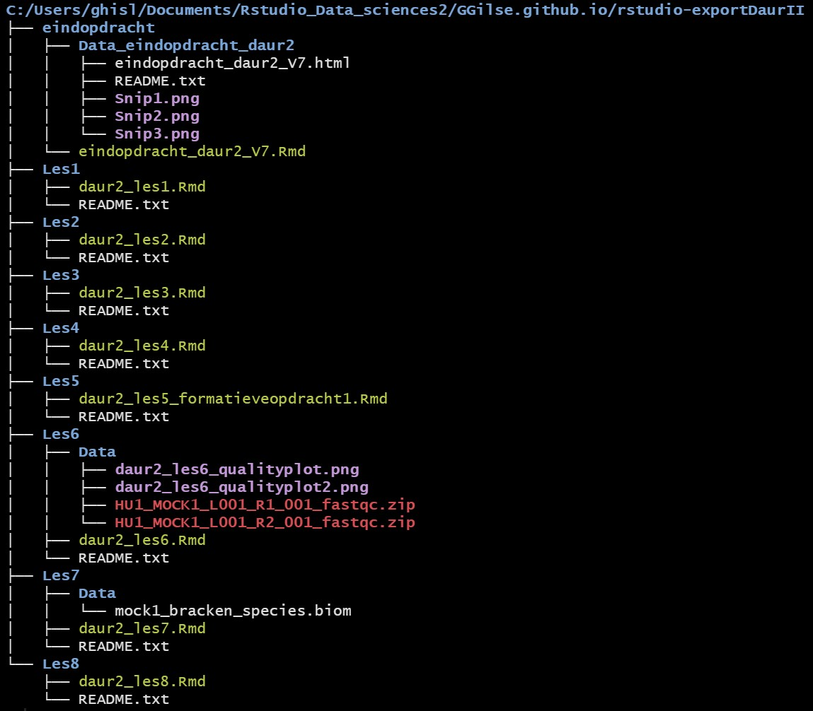

# Guerilla Principles
Here is how to install the fs package to make the dir tree for if needed
```{r install fs, eval=FALSE}
install.packages("fs")
```

If installed, this is the code to use to print the dir tree.
```{r fs dir tree, eval=FALSE}
fs::dir_tree(here::here("rstudio-exportDaurII"))
```

This is what my daurII looks like in the Geurilla principles.

